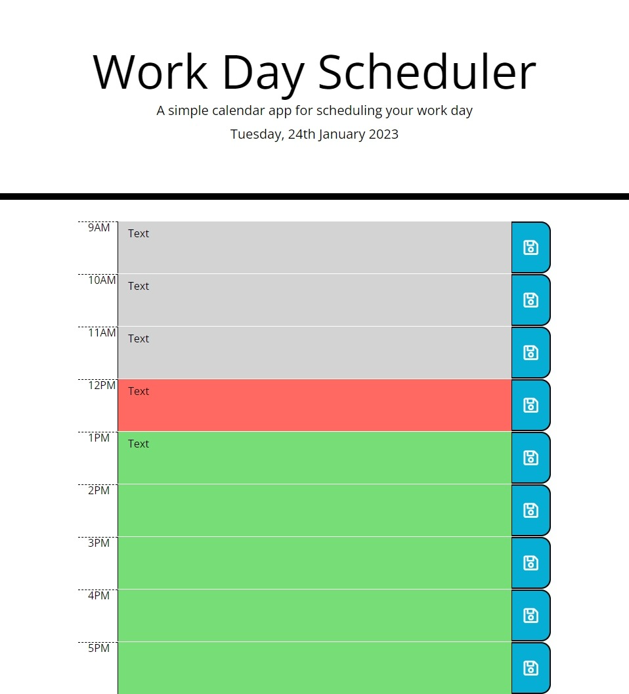

# SCHEDULE PLANNER

## Description
This project is an app to schedule your day plans.

Daily schedule app: 

## Installation
N/A

## Usage
It's shows current day, and colors on time block by the current time. It saves user inputs in to localStorage.

Link to live page: [Click here](https://markubil.github.io/SCHEDULE-PLANNER/)

## Credits
N/A

## License
 GNU GENERAL PUBLIC LICENSE

 Version 3, 29 June 2007

 Copyright (C) 2007 Free Software Foundation, Inc. <https://fsf.org/>
 Everyone is permitted to copy and distribute verbatim copies
 of this license document, but changing it is not allowed.

## Badges

